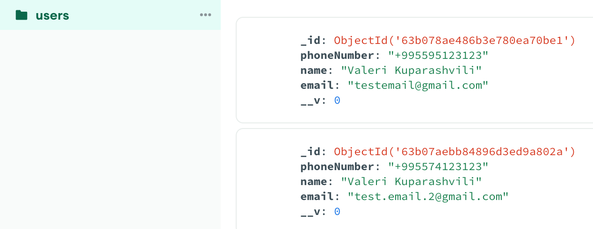

### General information - [https://nc-backend.herokuapp.com/](https://nc-backend.herokuapp.com/)

- Working on this project (BE + FE + Deployment) took me around 2 full days.
- Used `npm init` to initialize the package.json
- Used `tsc --init` to initialize the tsconfig.json
- Deployed on `Heroku`, had experience of deploying on Heroku before. While specifying firebase private key on Heroku env vars, make sure that you replace `\n` with actual new lines. Pushing changes on the `main` branch triggers automatic deployment on Heroku.
- Database - `MongoDB (Atlas)`. I worked with Firestore about 4 years ago, for a few months, but due to having a limited time, I decided to go with MongoDB, where I have more experience. Remark: since MongoDB doesn't have a "primary key" concept, I've made "phone number" to be unique.
- ! Swagger documentation is missing _(will be added if requested)_
- ! Tests are missing _(will be added if requested)_
- Screenshot of the documents in DB:



## Requirements

- [Node.js](https://nodejs.org/en/download/) v18 LTS

## Installation

(optional) Install [Prettier](https://marketplace.visualstudio.com/items?itemName=esbenp.prettier-vscode), [ESlint](https://marketplace.visualstudio.com/items?itemName=dbaeumer.vscode-eslint) and [SonarLint](https://marketplace.visualstudio.com/items?itemName=SonarSource.sonarlint-vscode) extensions for [VS Code](https://code.visualstudio.com/download).

Install dependencies:

```
npm install
```

Set default environment variables. Create a `Firebase` project and specify credentials:

```
cp .env.example .env
```

## Running

Run project locally:

```
npm run dev
```

## Testing _(tests will be added if requested)_

Run tests:

```
npm run test
```

## Building

Compile TS in JS:

```
npm run build
```

## Structure

```
.
├── build                             # Compiled files in JavaScript
├── src                               # Source files
|   ├── controllers                   # Handles req/res processing and services orchestration
|   ├── loaders                       # Handles all startup processes and initializations
|   ├── middlewares                   # Custom middlewares
|   ├── models                        # Schema of the database collections
|   ├── repositories                  # Database-related operations
|   ├── services                      # Business logic and repositories orchestration
|   ├── types
|   ├── utils                         # Utilities/helpers
|   ├── validations                   # Request payload validation schemas
|   ├── config.ts                     # Environment variables and secrets
|   ├── index.ts                      # Application entry point
|   └── routes.ts                     # Express routes that define API structure
```

## Response structure

Error:

```
{ status: <status code number>, success: false, error: <error message> }
```

Success:

```
{ status: <status code number>, success: true, data: ... }
```

## Multi-Layer (Layered) Architecture

Key characteristics: Ease of development for smaller teams and scalability, short learning curve, highly testable.

- API Layer _(routes, middlewares, validations, controllers)_
- Business Logic Layer _(services)_
- Data Access Layer _(repositories, models)_

## Principles

- **Separation of Concerns** _(if you apply this principle, you get layered architecture)_
  - **API Layer** - API. Request-response handling. Validate input, orchestrate services, deconstruct input object and pass to the relevant services, catch errors, and shape response with a status code and payload.
  - **Service Layer** - Business logic. Decoupled business logic from the infrastructure. Orchestrate database operations by utilizing the data access layer - repositories.
  - **Integration/Data Access layer** - Database. Everything related to operations and interactions with the database. Also, 3rd party integrations.
- **Single Responsibility** - A function or a class should have one responsibility.
- **[DRY](https://verraes.net/2014/08/dry-is-about-knowledge/)** - Don't Repeat Yourself.
- **YAGNI** - You Aren't Gonna Need It.
- **KISS** - Keep It Stupid Simple!

## Security

- **[DependaBot](https://docs.github.com/en/code-security/dependabot)** - Once per week, it will check new versions of npm dependencies, detect vulnerabilities, and create pull requests automatically to review, merge and easily update dependencies.
- **[eslint-plugin-security](https://www.npmjs.com/package/eslint-plugin-security)** - ESlint rules for Node.js security. Does static code analysis and helps to identify potential security hotspots while writing the code.
- **[Helmet](https://www.npmjs.com/package/helmet)** - Protects Node.js applications from several attacks.
- **[HPP](https://www.npmjs.com/package/hpp)** - Express middleware to protect against HTTP Parameter Pollution attacks.
- **[npm audit](https://docs.npmjs.com/cli/v8/commands/npm-audit)** - Built-in tool of NPM for the security audit. CI will fail if detected "high" level security vulnerability.
- **[SonarLint](https://www.sonarsource.com/products/sonarlint/)** - VS Code extension that provides real-time feedback on the issues while writing the code.

## Branching Strategy

| Branch         | Environment | Description                                             |
| -------------- | ----------- | ------------------------------------------------------- |
| main           | production  | Releases (Deployment to Production)                     |
| develop        | staging     | Integration branch for features (Deployment to Staging) |
| feature/{name} | development | Short-lived branches for feature development            |

## [Semantic Versioning](https://semver.org/)

| Major |     | Minor |     | Patch |
| :---: | --- | :---: | --- | :---: |
|   x   | .   |   x   | .   |   x   |

- **Major** - Backward-incompatible, breaking change;
- **Minor** - Backward compatible change (new feature/functionality, refactor);
- **Patch** - Bug fixes to existing functionality;

## [Conventional Commits](https://www.conventionalcommits.org/en/v1.0.0/)

```
<type>(<scope>): <short summary>
  │       │             │
  │       │             └─⫸ Summary in present tense. Not capitalized. No dot(.) at the end
  │       │
  │       └─⫸ Commit Scope: optional
  │
  └─⫸ Commit Type: build|chore|ci|docs|feat|fix|perf|refactor|test
```

The `<type>` and `<summary>` fields are mandatory, the `(<scope>)` field is optional.

##### Type

Must be one of the following:

- **build**: Updating build configuration, development tools or other changes - irrelevant to the user;
- **chore**: Trivial changes in the repository;
- **ci**: Changes to the CI configuration files and scripts;
- **docs**: Changes to the documentation;
- **feat**: A new feature;
- **fix**: A bug fix;
- **perf**: A code change that improves performance;
- **refactor**: A code change that neither fixes a bug nor adds a feature;
- **test**: Adding missing tests or correcting existing tests;

##### Scope

The scope cam be:

- Additional contextual information;
- Empty (optional): useful for `build:`, `ci:` and `docs:` changes that are done across the whole application;

##### Summary

Use the summary field to provide a short description of the change:

- Use the imperative, present tense: "change", not "changed" nor "changes";
- Don't capitalize the first letter;
- No dot (.) at the end;

## Code review

### You must always review your own code first.

The pull request must have at least 2 approvals to merge into the "develop" branch.

Pull Request review guideline:

- **Design:** Do the interactions of the various pieces of code make sense? Does this change integrate well with the rest of the code base? Is now a good time to add this functionality?
- **Functionality:** Does this code do what the author intended? Is what the author intended good for the users of this code (end-users AND developers)?
- **Complexity:** Can the code be understood quickly? Will developers be likely to introduce bugs when they try to call or modify this code? Is it over-engineered? Is it trying to solve a problem that the author speculates might need to be solved in the future instead of solving the problem they know needs to be solved now?
- **Tests:** Does the code have appropriate unit tests? Are they correct, sensible and useful? Review tests first, they will help you understand the intent of the author very quickly (could be just by looking at their names).
- **Naming:** Did the author pick good names for everything? Long enough to fully communicate what the item is or does, without being so long that it becomes hard to read?
- **Consistency:** Does the code follow the existing agreements about style, naming, files organization, etc.?
- **Documentation:** If the code changes how users build, test, interact with, or release code, check that the relevant documentation is also updated, deleted or added.
